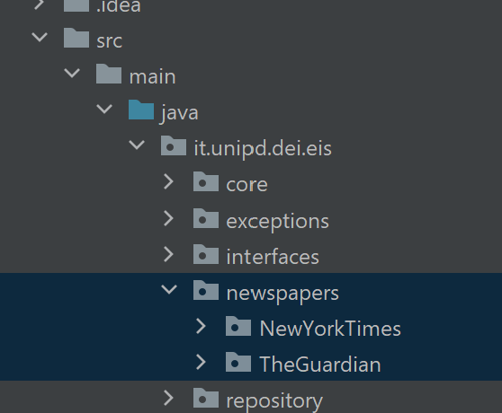
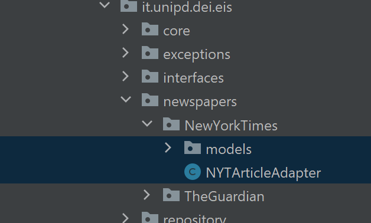
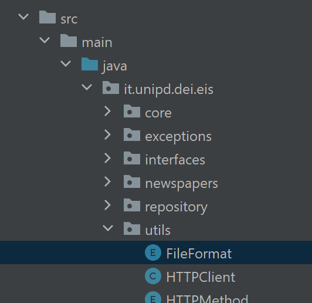
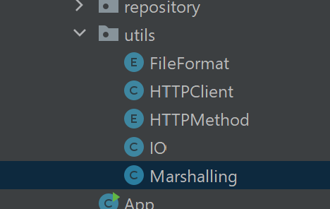
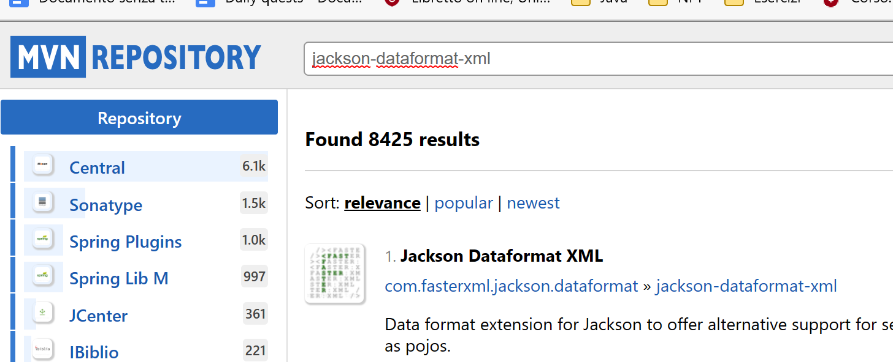
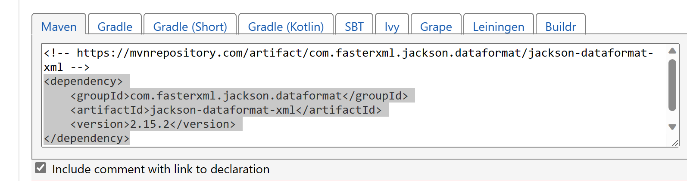

# Manuale

Per la consultazione del manuale è possibile fruire del PDF con una grafica leggermente diversa.

## Panoramica del Software


Il nostro software è stato progettato per analizzare articoli giornalistici provenienti da diverse testate online, inclusi The Guardian e The New York Times, al fine di classificare i termini più ricorrenti. Offriamo due funzionalità principali che possono essere eseguite in modo indipendente o in sequenza.

La prima funzionalità consente all'utente di scaricare articoli utilizzando una specifica query di ricerca e di selezionare il formato di salvataggio desiderato. Il software si interfaccia con le API messe a disposizione dalle testate giornalistiche, analizza la query e recupera gli articoli associati. Successivamente, i dati vengono memorizzati in una struttura interna e salvati nel formato specificato.

La seconda funzionalità esegue il ranking dei 50 termini più utilizzati negli articoli scaricati. Gli articoli vengono tokenizzati, lemmizzati e analizzati per conteggiare la frequenza di ogni parola. Questi algoritmi sono svolti in parallelo per migliorare le prestazioni. Alla fine, viene restituita una lista dei 50 termini più comuni presenti negli articoli di input.

Il software è dotato di un'interfaccia utente semplice implementata tramite una Command Line Interface (CLI). Un manuale è disponibile per fornire istruzioni dettagliate sull'utilizzo del software.

## Installazione e esecuzione del Software
### Prerequisiti
Assicurati di avere installato:
- [Maven](https://maven.apache.org/)
- [JDK 8](https://www.oracle.com/java/technologies/downloads/)

### Installazione
1. Scarica e estrai il file in formato zip
2. Entra nella cartella del progetto `eis-app`
3. Crea un file `env` in `src/main/resources`
4. Se hai intenzione di usare la testata giornalistica *The Guardian*, aggiungi `THE_GUARDIAN_API_KEY=key` nel file `.env`, sostituendo *key* con la tua chiave
5. Compila il progetto con

```bash
mvn package
```

6. Avvia l'app con

```bash
java -jar target/eis-app-*-jar-with-dependencies.jar [options]
```

## Utilizzo di funzioni di librerie esistenti

### Libreria Jackson v. 2.14.0

1. classe **ObjectMapper**:
    - **readValue(content, type)**: Questa funzione viene utilizzata per deserializzare un oggetto da una stringa nel formato specificato. La stringa content viene convertita nell'oggetto del tipo specificato (type).
    
    ```java
    return mapper.readValue(content, type); //nella della classe Marshalling
    ```
    
    - **writeValueAsString(object)**: Questa funzione viene utilizzata per serializzare un oggetto in una stringa JSON.
    
    ```java
    return mapper.writeValueAsString(object); //nella classe Marshalling
    ```
    
2. classe **SequenceWriter:**
    - **write(element)**: Questa funzione viene utilizzata per scrivere un elemento nella sequenza di output durante la serializzazione.
    
    ```java
    for (Object element : arrayList) { //nella classe Marshalling
        seqW.write(element);
    }
    ```
    
3. **CsvMapper**:
    - **readerFor((Class<?>)baseType).with(content).readAll()**: Questa sequenza di funzioni viene utilizzata per deserializzare dati CSV. Legge i valori CSV dalla stringa ‘content’ utilizzando il tipo di base specificando (‘baseType’) e lo schema dell’intestazione (‘headerSchema’).
    
    ```java
    return (R) mapper.readerFor(((Class<?>) baseType)) //nelle classe Marshalling
            .with(headerSchema)
            .readValues(content).readAll();
    ```
    
4. classe **XmlMapper**:
    - Utilizzato nel metodo **getMapper(Format f)** per ottenere **ObjectMapper** configurato per il formato XML.
    
    ```java
    return new XmlMapper(); //nella classe Mashalling
    ```
    
5. Classe **JavaTimeModule**:
    - Viene utilizzata per registrare il modulo **JavaTimeModule** nell’ **ObjectMapper**. Questo modulo gestisce la serializzazione e la deserializzazione di oggetti temporali, come nel nostro caso le date.
    
    ```java
    mapper.registerModule(new JavaTimeModule()); //nella classe Mashalling
    ```
    

## Libreria JUnit Jupiter v. RELEASE

1. **@Test**: Questa annotazione viene utilizzata per identificare i metodi di test. I metodi annotati con @Test vengono eseguiti come test case durante l’esecuzione dei test.
    
    ```java
    @Test //nella classe NewYorkTimesAdapterTest
    			//nella classe TheGuardianAdapterTest
    ```
    
2. **@BeforeEach**: Questa annotazione viene utilizzata per marcare un metodo all’interno di una classe di test come metodo di inizializzazione. Il metodo annotato con @BeforeEach viene eseguito prima di ogni metodo di test all’interno della classe.
    
    ```java
    @BeforeEach //nella classe TheGuardianAdapterTest
    ```
    
3. classe **Assertions:**
    - **assertEquals():** Questo metodo viene utilizzato per verificare che un valore atteso sia uguale a un valore ottenuto. Viene passato il valore atteso come primo argomento e il valore ottenuto come secondo argomento. Se i valori sono diversi, il test fallisce e viene generata un’asserzione fallita.
        
        ```java
        Assertions.assertEquals("123456", adapter.getId()); //nella classe NewYorkTimesAdapterTest
        ```
        
        ```java
        Assertions.assertEquals("Sample Article Title", adapter.getTitle());//nella classe NewYorkTimesAdapterTest
        ```
        
        ```java
        Assertions.assertEquals("Sample article body content", adapter.getBody()); //nella classe NewYorkTimesAdapterTest
        ```
        
        ```java
        assertEquals(expectedTitle, actualTitle); //nella classe TheGuardianAdapterTest
        ```
        
        ```java
        assertEquals(expectedBody, actualBody); //nella 54esima riga della classe TheGuardianAdapterTest
        ```
        
    - **AssertNotNull()**: Questa funzione viene utilizzata per verificare che un valore atteso non sia nullo.
    
    ```java
    assertNotNull(actualTitle); //nella 41esima riga della classe TheGuardianAdapterTest
    ```
    
    ```java
    assertNotNull(actualBody); //nella 41esima riga della classe TheGuardianAdapterTest
    ```
    

### CoreNPL (Standford) v. 4.4.0

1. classe StanfordCoreNPL:
    - Annotate(): Questa funzione viene utilizzata per eseguire l’annotazione del documento fornito in input utilizzando le pipiline fornite di annotazione Staford CoreNPL. Nel nostro programma viene utilizzata da:
        - Nel metodo extractTokens() viene utilizzata per estrarre i token (singole parole) presenti nel testo
        - Nel metodo extractLemmas() viene utilizzata per estrarre i lemma (il lemma di una parola rappresenta la sua forma base o radice) presenti nel testo
        - Nel metodo extractNouns() viene utilizzata per estrarre i sostantivi (nomi) presenti nel testo

### Aggiungere un nuovo giornale

Qui trovi la guida su come aggiungere ulteriori testate giornalistiche al software.

1. Come prima cosa dobbiamo creare la cartella per il nuovo giornale
    - Apriamo la cartella src/main/java/it.unipd.dei.eis/newspapers e creiamo la cartella con il nome del giornale che vogliamo aggiungere.
    
    <aside>
    💡 Importante: scrivere il nome tutto attaccato e in camel case. Ad esempio se voglio aggiungere il giornale The Times lo scriveremo TheTimes
    
    </aside>
    
    
    
    Come si può notare New York Times e The Guardian sono scritti senza spazi e in camel case.
    
2. All’interno della cartella creiamo:
    1. Una cartella models
    2. L’Adapter del giornale
    
    <aside>
    💡 L’Adapter del giornale lo dobbiamo nominare utilizzando le lettere maiuscole del camel case del giornale seguito da ‘ArticleAdapter’
    
    </aside>
    
    
    
    Come si nota l’Adapter del New York Times è scritto NYTArticleAdapter
    
3. L’Adapter deve (NOTA: gli esempi di codice si riferiscono alla classe NYTArticleAdapter):
    - Implementare l’interfaccia `it.unipd.dei.eis.interfaces.IArticle`
    
    ```java
    public class NYTArticleAdapter implements it.unipd.dei.eis.interfaces.IArticle{}
    ```
    
    - Essere salvato in un attributo interno
    
    ```java
    private final NYTArticle article;
    ```
    
    - Possedere un costruttore
    
    ```java
    NYTArticleAdapter(NYTArticle article) {
            this.article = article;
        }
    ```
    
4. La cartella models deve:
    - contenere una classe Article (preceduta nel nome sempre dalle lettere maiuscole del camel case) che contiene:
        - Tutti gli attributi presenti nell’API del giornale (come Titolo, Url, Data di pubblicazione, … ), salvati in formato private.
        - Tutti i metodi get e set per ogni attributo
    
    <aside>
    💡 Nel caso in cui ci sia un attributo complesso con ulteriori informazioni, è necessario creare una classe dedicata per rappresentare quel particolare attributo.
    
    </aside>
    

### Come aggiungere nuove fonti

Qui trovi la guida su come aggiungere ulteriori fonti al software.

1. Aggiornare l’enumerazione ‘File Format’: 
    - All’interno della cartella src/main/java/it.unipd.dei.eis/utils troverai l’enumerazione FileFormat
    
    
    
    - Al suo interno troverai un’enumerazione con tutti i formati accettati, quello che ti basterà fare sarà aggiungere il nuovo formato
2. Aggiornare il codice principale:
    - Ora sempre nella stessa cartella ‘utils’ troverai la classe Marshalling
    
    
    
    - In questa classe dobbiamo aggiornare la funzione ‘getMapper(FileFormat f)’ aggiungendo allo switch il case con il nuovo formato che si desidera aggiungere:
    
    ```java
    switch (f) {
                case XML:
                    return new XmlMapper();
                case CSV:
                    return new CsvMapper();
                case JSON:
    						case *NuovoTipo*:
                default:
                    return new ObjectMapper();
            }
    ```
    
3. Aggiungere la direttiva del formato:
    - Puoi trovare le dipendenze di Jackson nel repository di Maven Central all’indirizzo: https://search.maven.org/
    - Puoi cercare la dipendenza relativa al formato utilizzando la barra di ricerca. Ad esempio “jackson-dataformat-xml” per trovare la dipendenza per il formato XML.
    
    
    
    - Trovata la dipendenza desiderata, seleziona la versione e copia le linee relative la dipendenza nel file pom
    
    
    
4. Lanciare il software e controllarne il corretto funzionamento
5. Possibili problemi e errori, come risolverli:
    - Non trovo il mio formato nelle librerie Jackson?
        - Cerca un’altra libreria che possa fare la serializzazione e la deserializzazione del formato.
    - Non serializza e deserializza l’articolo del formato?
        - Implementa la serializzazione e la deserializzazione per il tuo formato
        
        <aside>
        💡 Questo succede come nel caso del formato CSV, che non è supportato nativamente da Jackson, dove sarà, quindi, necessario implementare i metodi serialize e deserialize specifici per il nuovo formato.
        
        </aside>